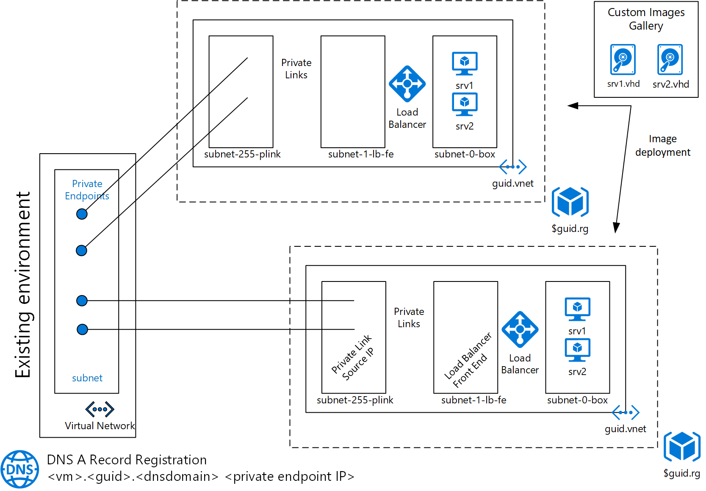

# DevTestLabs

A set of ARM templates to deploy a dev&test environment made of:
 - a virtual network with 3 subnets. 
 --   subnet-0-box for the VMs
 --   subnet-1-lb-fe - load balancer front-end IPs (load balancer is required to access the environment through private endpoint & links )
 --   subnet-255-plink - source IPs for Azure Private Links
 Each vnet is created with the same scope  
 - a set of virtual machines connected to "subnet-0-box". This is the actual dev environment. The VMs are based on custom images hosted in an Azure Shared Gallery. The list of VMs to be deployed is collected from vmlist.csv file if deployed from powershell or in the Azure Pipeline (.yml file). 
    VM's IP: 10.0.0.VMIndex_from_vmlist.csv. 
 - each environment is created in its own Resource Group
 - an Azure Private Link & Private Endpoint is created from an existing vnet to each VM in each environment. A load balancer is put in front of each environment (cannot put a private link directly into a vnet, it requires a PaaS service or load balancer)
 - $srv.$guid.$dnszone DNS records are created pointing to the Azure Private Endpoint IPs from the existing vNet. DNS registration is done from an on-premise server (In Azure Pipeline, the tasks in run as a deployment in an environment/virtualmachine)

 